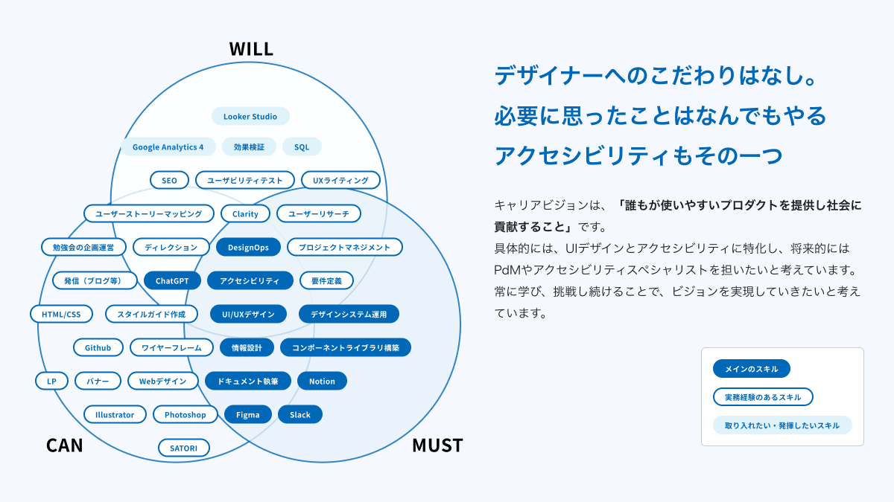

# 職務経歴書

## 職務要約

「より多くの人ができる限り困らない状態」を目指し、デザイン業務に従事しています。  
現在はデザインシステム構築、ユーザーリサーチ、アクセシビリティ向上、チーム内外でのデザイン・コミュニケーション促進を中心に業務していますしています。
生成AIを活用した効率化や新たな挑戦にも積極的です。
制約の中でもユーザーにとって価値のあるプロダクトを提供することを目指しています。

---

## 強み

私の強みは、プロダクトの品質向上を目指した継続的な向上意欲とプロジェクト推進、生産性向上のための挑戦です。

- プロダクトの品質向上：デザインシステムの構築、アクセシビリティ向上
- プロジェクトの推進：チーム目標に向けリサーチの主導、イベントの主催
- 生産性向上：業務フローの見直し、AIの活用

長所を生かし、会社やプロダクト、チームとともに成長し続けられる存在になっていきたいと思っています。

---

## 業務スキル

以下は業務から得たスキルの一部です。

### デザインシステムの構築

- デザインシステムの設計・運用と導入
- スタイルガイドの作成
- コンポーネントライブラリの構築
- ドキュメントの整備と管理
- Figma,VariantsやVariables

### サービス改善

- 課題の言語化、仮説をPOとともに検討
- 仮説からのUIデザイン
- エンジニア、POとコミュニケーションをとりながらUIデザインのバランス調整
- 課題の分析と解決策の提案

### チームサポート

- ミーティングの進行・調整、アジェンダ作成
- タスクの優先順位付けと進捗管理
- チームメンバーの目標設定リードとフィードバック

##　できること・やりたいこと

### Will Can　Must
現在できること、今後やりたいことをまとめた図になります。

今後、主に以下のことに取り組みたいと思っています。

- 必要に応じたユーザーリサーチを伴ったプロダクト開発
- PO・エンジニアのいるチームでの開発
- できるところからのアクセシビリティ改善

---

## 職務経歴詳細

### デザインシステムの構築

- 役割：UIデザイナー

- 概要
  - 拡張性を持ちながらUIデザインの品質を高められようにする為の一貫した仕組みを作るためのデザインシステム
  - デザイン原則をもとに、スタイルガイド、コンポーネントライブラリ、運用方法（スタイルやコンポーネントの作成やドキュメント）等を構築・整備
  - デザインシステム構築チーム外への推進、フォロー
  - Variablesの構築
  - デザイン基盤チームからのリデザイン

- 成果
  - 他チームの施策デザイン・実装コストの削減
    - デザインと開発の間の連携が強化され、プロジェクトの生産性が向上
  - レガシーデザイン・コードの負債解消（途中）

### 本人確認推奨化

- 役割：デザイナー

- 概要
  - 本人確認プロセスのデザインを担当
  - UIデザインから通知文面、HTMLメールの作成まで一貫して実施

- 成果
  - ユーザー信頼性向上
  - 事業リスクの削減

### アクセシビリティ文化の醸成

- 役割：プロジェクトマネジメント、デザイナー

- 概要
	- クラウドワークスとSmartHRが共同で開催したアクセシビリティイベント「出張！俺の仕事探し」の企画・運営を担当
    - 弱視特性を持つテスターによる実際のサービス利用テストを実施
	  - アクセシビリティ改善点の洗い出しと議論を推進
	- 社内外に向けたアクセシビリティ啓蒙活動を推進
	  - 勉強会やワークショップの企画・実施
	  - 他社との交流会を開催し、知見を共有
	- イベント準備段階から参加者との密なコミュニケーションを実施

- 成果
  - アクセシビリティに関する社内の理解と意識が向上
  - デザイナー間におけるアクセシビリティ意識の向上
    - デザインシステムのスタイル・コンポーネントのドキュメントに、考慮事項として記載項目を用意し明文化
    - デザイン時に画像を使用した際はaltの有無を担当デザイナーが検討していくように
    - アクセシビリティ意識の向上から、サービスの一部改善への提案がスムーズに

- レポート
  - [クラウドワークス×SmartHR「出張！俺の仕事探し」〜クラウドワークスをアクセシビリティチェック レポート #smarthr_a11y](https://note.com/haribom/n/n20ae3ecbefd2)
  - [クラウドワークス×SmartHR「出張！俺の仕事探し」〜クラウドワークスをアクセシビリティチェックの裏側 何より準備・仲間づくり #smarthr_a11y](https://note.com/haribom/n/nd3fd41e9ea84)

### SalesforceでのFAQサイト、Chatbot構築

- 役割：デザイナー、コーダー

- 概要
  - Salesforce上でのFAQサイト構築において、カスタムCSSを用いてデザインを最適化
  - 視認性向上と一貫性あるデザインを実現

- 成果
  - ユーザーの情報検索効率を改善
  - 問い合わせ率の削減
  - 視認性の向上
 
### ユーザーリサーチ

- 役割：デザイナー

- 概要
 - チームのプロダクトゴールの達成のため、リサーチのプロジェクト推進
 - ユーザーインタビュー、分析
 
- 成果
 - リサーチプロジェクトのドキュメント化
 - チームのプロダクトバックログアイテム化

### マーケティング領域、プロダクト認知施策

- 役割：デザイナー

- 概要
  - マーケティング・PdMとともにSEO施策を検討・実施
  - ポップアップやバナー、LPの作成を担当

- 成果
  - サービスのSEO基盤整備とプロダクト認知向上に貢献

### Chat GPTでのユーザーストーリーマッピング

- 役割：デザイナー

- 概要
  - ChatGPTを活用してユーザーストーリーマッピングを実施
  - ユーザーフローの課題点を明確化し、施策検討・設計効率を向上

- 成果
  - チームの工数を抑え、プロジェクト施策検討・設計効率を向上

---

### 副業（一部）

#### 副業
- デザインリサーチおよびレビューのアドバイスを提供し、クライアントのサービス改善を支援  
- アプリのUIデザインやバナー作成など、幅広いデザイン業務を担当
- アクセシビリティチェックの実施と改善提案のドキュメント化

### その他

- 他社とのアクセシビリティに関する交流会を実施

---

## 資格・証明

| 項目     | 取得年月日 | 
| -------- | -------- | 
| ITパスポート | 2022年4月| 
| [デジタルアクセシビリティアドバイザー](https://www.openbadge-global.com/ns/portal/openbadge/public/assertions/detail/SW1tc2FydlFhbHM4RlFFT1ZKUmpXQT09) | 2024年5月| 
| [デジタル推進委員](https://www.openbadge-global.com/ns/portal/openbadge/public/assertions/detail/WUFEajA3OEZnTlJMSXRhd3NvU2g4dz09) | 2024年7月| 

---

## 意欲・興味

- PO・エンジニアのいるチームとのプロダクト開発
- ユーザビリティテストを通じたデータドリブンなデザイン改善
- アクセシビリティを考慮したプロダクト開発
- プロダクトマネジメントスキルを高め、より広範な視点でサービス開発
